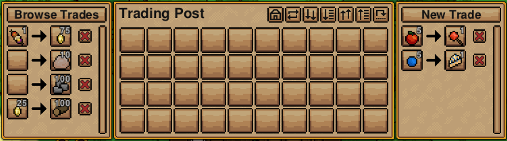
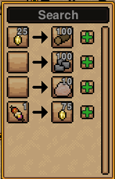
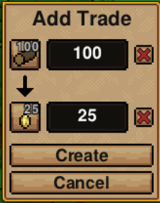

[](https://steamcommunity.com/sharedfiles/filedetails/?id=2938316751)

---

A settlement to settlement trading mod for Necesse.

Construct trading posts to move items between your settlements! Great for multiplayer servers with a spread out
playerbase to create an interconnected global empire or a singleplayer world with diverse settlement goals. Missing
certain resources that you know your friend has lots of? Just want to collect coconuts from your ~~slave compound~~
productive desert village? This may be just the mod for you!

# Trading Post

This mod introduces a single new item: **The trading post**.


| Ingredient | Amount |
|:----------:|:------:|
|  Any Log   |   50   |
|    Wool    |   10   |
|  Gold Bar  |   20   |

Trading posts are crafted in the [demonic workstation](https://necessewiki.com/Demonic_Workstation) (or any higher tier)
from logs, wool, and a couple gold bars. Unfortunately there's nothing I can do about the gold costs, the traders' guild
fees are quite steep. Trading posts also allow settlers to automatically add and remove items from the internal storage
just like any other settlement-capable inventory.

Once you have your hands on a trading post you are unstoppable! Your power unrivaled! anything you can imagine is
possible!

_Unless_, of course, you want to actually move items around. For that you'll need another trading post.

With a second trading post in hand (or a friend with one) you can set up your first trade deal!

# Trading

Creating a new trade is relatively straightforward.

1. Right-click on your trading post to open the interface and click the **`New Trade`** button at the top of the
   right-most window.
2. Choose which items and amounts you want to trade. Click the item slots to choose from all possible items, and edit
   the amount as desired using the input fields on the right.
3. Click the **`Create`** button to finalize the trade offer!

However, nothing much will happen without a willing recipient. In order to accept the trade and start moving items, a
second trading post needs to subscribe to your fair and balanced offer.

1. Open up the interface of the second trading post and this time click **`Browse Trades`** at the top of the left-most
   window.
2. Scroll through the list of available trades (using the search field if necessary) and click the plus button to
   subscribe to the trade.

As long as the trade agreement is in effect (i.e. source has not removed the trade, and destination has not
unsubscribed), an attempt to trade will be made every trade cycle (speed of trade cycles is configurable).

# Trading Post Interface

## Main interface



You'll notice that the interface looks similar to any other settlement-capable storage (
i.e. [Barrel](https://necessewiki.com/Barrel) or [Chest](https://necessewiki.com/Chests)), storing up to 40 stacks of
items in its internal inventory. However, there are two new windows to the left and right of the internal inventory.

On the left is the _incoming_ or _subscribed_ trades view. This is where you'll see any trades that the trading post has
accepted. Unsubscribe from any trade by clicking the red **`x`**. The **`Browse Trades`** button at the top opens the
available trades popup.

On the right is the _outgoing_ or _offered_ trades view. It has a list of all trades owned by the trading post. Clicking
the red **`x`** next to any of the trades will delete it. The **`New Trade`** button will switch to the new trade
window.

## Available trades



The available trades popup is used to view available trades offered by other trading posts. You can search the list of
offers by typing in the search bar at the top. Clicking the **`+`** icon next to any of the offers will subscribe the
trading post to that trade.

Multiple trading posts can be subscribed to the same trade offer. Subscribed trading posts are handled on a
first-come-first-served basis (i.e. first one to subscribe to a trade gets priority).

## New trade



The new trade window allows you to create a new trade (surprise!). It has controls for specifying the import/export
items and their amounts. Clicking the item slots opens a popup to choose the item, and the amount is configurable by
using the number input field to the right of each item icon.

If you want a one-sided trade (i.e. you have too much stone and want to give it away for free), the red **`x`** button
next to each item control will clear that item.

# Limitations

- Trades are not a 1-off deal. While a trade offer has been subscribed to, the broker will attempt to fulfill it every
  cycle.
- Each side of a trade can consist of either nothing, or one type of item. There is no current way of trading, for
  example, coins and logs for wheat.
- You cannot create a trade with a zero-amount item. This is to clear up confusion around zero of an item v.s. no item
  set (see? Confusing). If you want to send/receive no items, click the red **`x`** next to the item while creating the
  trade.
- Each trading post has a configurable limit on the number of created/subscribed trades.
- Trading posts only function within a player-owned settlement. This is by design.
- Trades can only be created/removed/subscribed/unsubscribed by a player with settlement access. However, there is
  nothing stopping a player without settlement access from simply destroying the trading post.

# Configuration

Silk Road currently has four different configuration settings. These settings can be modified by editing the mod's
config file (created when the game is first started with the mod) using your favourite text editor (`vim`, right?).

|   OS    | Location                                                                 |
|:-------:|:-------------------------------------------------------------------------|
| Windows | `%appdata%\Necesse\cfg\mods\snoobinoob.silkroad.cfg`                     |
|  Linux  | `~/.config/Necesse/cfg/mods/snoobinoob.silkroad.cfg`                     |
|  MacOS  | `~/Library/Application Support/Necesse/cfg/mods/snoobinoob.silkroad.cfg` |

The default configuration file looks like this:

```
{
	SETTINGS = {
		worldtimepertrade = 10000,
		maxoutgoingtrades = 5,
		maxincomingtrades = 5,
		maxtradedistance = -1
	}
}
```

## `worldtimepertrade`

Default: 10 seconds.

This setting controls how often the mod attempts to trade. Every `worldtimepertrade` milliseconds, the system iterates
through every trade offer and attempts to execute it. Sleeping causes world time to move faster, so if you find yourself
waiting on slow trades, just take a quick snooze!

## `maxoutgoingtrades`

Default: 5 trades.

This setting controls how many concurrent trade offers a trading post is allowed to create.

## `maxincomingtrades`

Default: 5 trades.

This setting controls how many concurrent trade offers a trading post is allowed to accept.

## `maxtradedistance`

Default: -1 (infinite distance)

This setting is used to control how far (in tiles) trade deals can span. For example, with a value of 300, trades can
occur between trading posts that are within a [taxicab distance](https://en.wikipedia.org/wiki/Taxicab_geometry) of 300
tiles.

Specifying a value of `-1` allows trades to be accepted from any distance.

# The Trade Cycle

For those interested in a more specific dive into how trades are orchestrated, here's a little rundown and some
nitty-gritty details.

The nebulous trade broker (they're up there somewhere, always watching) processes all trades at the start of every trade
cycle (period is configurable). Processing a trade involves a few things.

1. Checks that the trade has at least one subscriber.
2. Checks that the source trading post is valid, i.e. in a player-owned settlement and not destroyed.
3. Ensures that the source has all required items.
4. Finds the first valid subscribed trading post. Similar check as with the source.
5. If the subscriber has all the required items, then the trade is executed and the broker moves on to the next trade.
6. If the first subscriber does not have enough items, the broker checks the next valid subscriber (and so on)

There are also check in place to ensure that both source and destination have enough space for the new items.

# Possible Future Work

## 1-off trades

Currently, trades can execute forever or until manually unsubscribed/removed. I have considered adding the option for
trades to execute N times before being auto-removed. This is support the use-case of requesting 1 and only 1 of an item.
Say I'm looking to upgrade my pickaxe, so I make a 1-time trade offer for an ice pickaxe. After I've received my
pickaxe, the trade will disappear.

Due to my love of configurability, I don't want to limit this feature to either 1 or infinite, but anywhere between.

## Multi-item trades

Trades support at most one type of item per side. It could be really cool to allow more complex, customizable, trades.
This is more of a UI problem than a code problem. Modifying the code to process multi-item trades shouldn't be too hard,
but I honestly have no idea how to update/tweak the interface to make this clear and understandable.

## No same-settlement trades

The more (or less?) adventurous player may have already noticed that a trade deal can be struck between two different
trading posts on the same settlement. I personally don't know how I feel about this. On one hand it's not exactly
logical (why trade with yourself?), and on the other hand it doesn't hurt to have additional item movement options.

In order to address this, I've thought about adding a new configuration option to control whether these same-settlement
trades can be created. That way I never have to decide and I can leave it up to each individual player. You know that
you know best.
